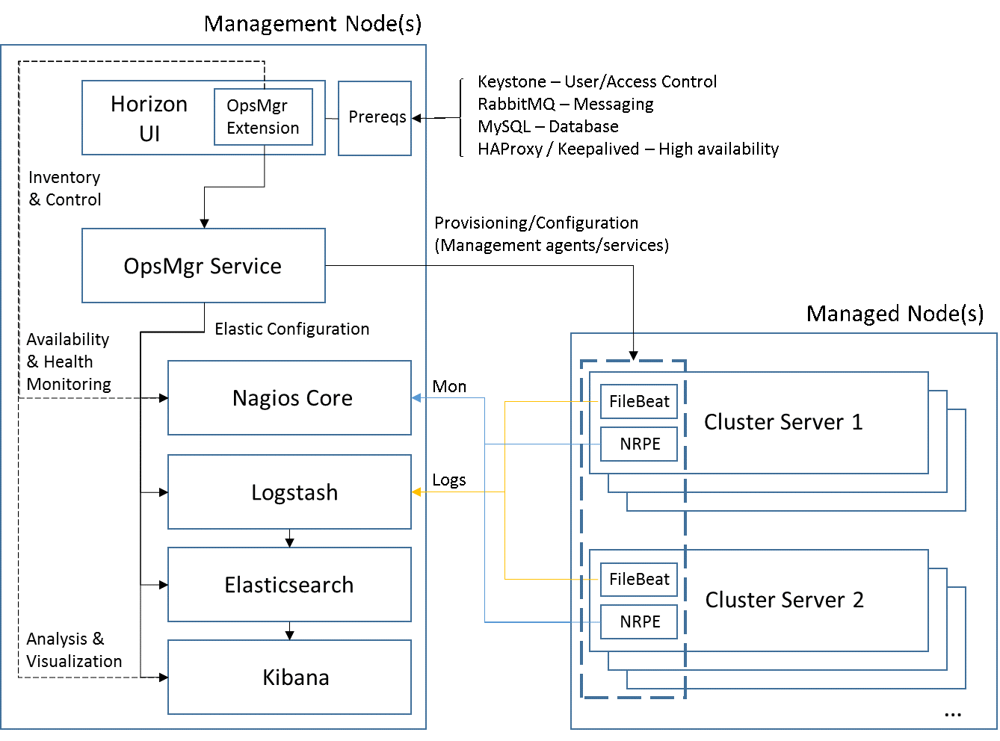
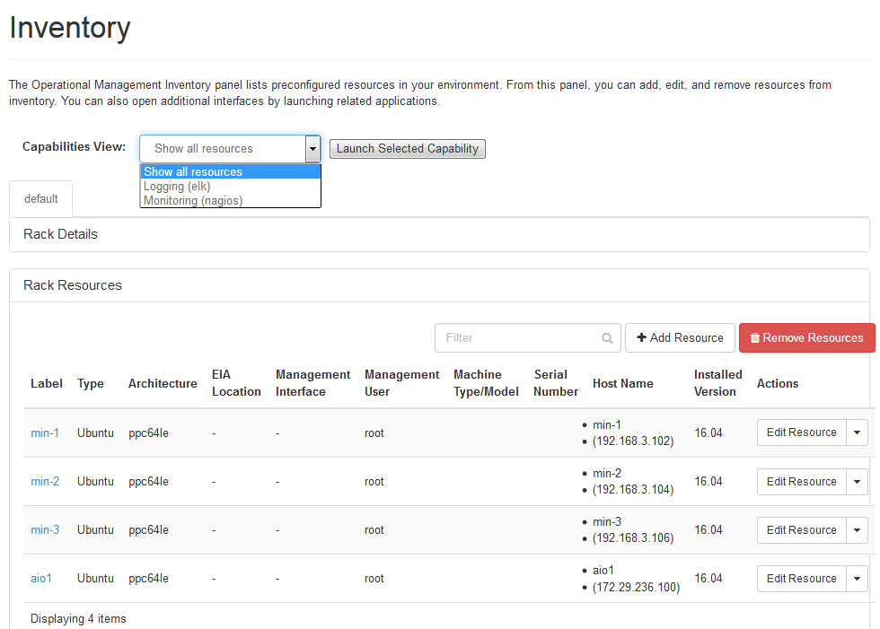

**Overview & Architecture**
===========================

The Operations Manager (OpsMgr for short) project implements an unified
portal that integrates operational management components, such as Nagios
Core and the ELK stack (ElasticSearch, Logstash, Kibana) - two leading
open source projects for monitoring and data/log analysis, respectively.
In addition there is a built-in component that provides inventory
collection & management, and elastic reconfiguration of all other
integrated components. The following picture illustrates the OpsMgr
architecture and depicts its components and runtime layout.

|image1|

Management applications such as Nagios and ELK consist of different
types of components:

-  A Graphical User Interface application, usually Browser-based and
   hosted in a Web server
-  Server-side services that provide management functions
-  Client-side services that provide remote collection and/or probing
   to feed data to the server services

As the picture above illustrates, OpsMgr controls and integrates other
Ops management components. The OpsMgr Horizon extension provides an
integration portal user interface which coordinates launch in context
to the Nagios and Kibana GUIs. The OpsMgr service controls and configures
both server-side and client-side components. On the managed nodes the
client-side components are deployed and configured to work with their
server-side counterparts:

-  Filebeat and Metricbeat send data back to be processed by ELK services
-  NRPE service sends probe results back to the Nagios Core service

For provisioning purposes OpsMgr uses Ansible (a popular open source
provisioning & configuration tool) to deploy and configure all necessary
management components onto each managing and managed nodes. The following
picture shows the different stages Ansible goes through when installing
and configuring the Operations Manager stack.

|image2|

Integration playbooks are used to orchestrate how the Management and
Managed stacks are installed. There are multiple integration playbooks
and each one controls how the additional playbooks are called and what
components are ultimately installed and where. These integration
playbooks are referenced as "recipes". The main reason for having
orchestrating "recipes" for OpsMgr is that, depending on where and how
OpsMgr is installed, different management components and Ops packages for
endpoint monitoring are installed and configured in the cluster.

There are three main OpsMgr "recipes" currently:

    - `OpsMgr Minimal <https://github.com/open-power-ref-design-toolkit/opsmgr/tree/master/recipes/minimal>`_
    - `OpsMgr Standalone <https://github.com/open-power-ref-design-toolkit/opsmgr/tree/master/recipes/standalone>`_
    - `OpsMgr for Cloud <https://github.com/open-power-ref-design-toolkit/opsmgr/tree/master/recipes/privatecloud-newton>`_

The default mode of installation for OpsMgr is "OpsMgr for Cloud".

For specific installation and configuration instructions on each of these
"recipes" please refer to their respective README files in the links above.

**Accessing the Operations Portal**
-----------------------------------

Once OpsMgr is installed then end users can access the Operations Portal by
entering their management node address into a web browser::

    https://<MGMT_NODE_IP_ADDRESS>

A default user and password for the Administrator superuser is generated at
deployment time and can be found by looking at the contents of the following
file as root user in the deployment node: /etc/openstack_deploy/user_secrets.yml

Example::

    > grep "keystone_auth_admin_password" /etc/openstack_deploy/user_secrets.yml
    keystone_auth_admin_password: ef00d5c5630c8917eca3f002797354f8

For security purposes it is recommended that users change this default password
immediately after initial login. This can be done with the following steps:

1. Open the Operations Portal
2. Select Identity Users
3. Click on the Edit Change Password drop-down, and specify the new password.
4. Re-login once the password is changed.

**Accessing the integrated Operational Applications**
-----------------------------------------------------

In the Operations Portal an user can view a list of hardware resources that
make up the cluster and is able to launch other integrated Ops applications
that are part of the OpsMgr stack (such as Nagios or Kibana). The following
picture illustrates a sample cluster as an example:

|image3|

All resources are automatically configured at provisioning time with lightweight
agents that will report monitoring and log data back to the Operational
applications integrated in the OpsMgr stack. The Operations Portal has a drop
down field called "Capabilities View" that lists all integrated Operational
applications. Currently the following options are supported:

-  Nagios (for monitoring and alerting)
-  ELK (for Log/Data collection, analysis and metrics visualization)

Selecting one of the above options and clicking the "Launch selected capability"
button causes the corresponding Operational application to be launched in it's
initial panel where the user can then login and access it.

The default users and passwords for these applications are::

    Nagios user: nagios
    Nagios password: nagios
    Kibana user: kibana
    Kibana password: kibana

For security purposes it is recommended users change these passwords immediately
after initial login. Documented practices to change default passwords for other
Ops applications should be observed as well. Since OpsMgr does not yet have a
single sign-on and user control mechanism, users can change the default passwords
and create any new users into each Operational application by using the instructions
in its respective documentation at the following locations:

-  Nagios: https://assets.nagios.com/downloads/nagioscore/docs/nagioscore/4/en/
-  ELK: https://www.elastic.co/guide/index.html

If different default credentials are desired before initial installation, please
set or modify the following Ansible variables:

For Nagios::

    nagios_group: nagios (all configuration for Nagios can be changed by users
                  belonging to this group)
    nagios_user:  nagios
    nagios_pass:  nagios
    Location: playbooks/roles/nagios/defaults/main.yml
    (or use standard Ansible override mechanisms: vars, group_vars, extra_vars, etc.)

For Kibana::

    kibana_service_user: kibana
    kibana_password: kibana
    Location: playbooks/roles/kibana/defaults/main.yml
    (or use standard Ansible override mechanisms: vars, group_vars, extra_vars, etc.)

Passwords for the OpsMgr database are randomly generated and stored in
/etc/opsmgr/user_secrets.yml on the deployment node.

Default values for other Ansible variables may be overridden as well. For options
please check this file: playbooks/defaults.yml

Bug Reporting
-------------

The current list of bugs can be found on launchpad:
https://bugs.launchpad.net/open-power-ref-design

Related projects
----------------

Recipes for OpenPOWER servers are located here:

    - `Recipe directory <https://github.com/open-power-ref-design/>`_

Here, you will find several OpenStack based recipes:

    - `Private cloud w/ and w/o Swift Object Storage <https://github.com/open-power-ref-design/private-compute-cloud/blob/master/README.rst>`_
    - `Database as a Service (OpenStack Trove) <https://github.com/open-power-ref-design/dbaas/blob/master/README.rst>`_
    - `Standalone Swift Clusters (OpenStack Swift) <https://github.com/open-power-ref-design/standalone-swift/blob/master/README.rst>`_
    - `Standalone Ceph Clusters <https://github.com/open-power-ref-design/standalone-ceph/blob/master/README.rst>`_

The following are related projects that provide services used as major building blocks
in recipes alongside OpsMgr:

    - `cluster-genesis <https://github.com/open-power-ref-design-toolkit/cluster-genesis>`_
    - `os-services <https://github.com/open-power-ref-design-toolkit/os-services>`_
    - `ceph-services <https://github.com/open-power-ref-design-toolkit/ceph-services>`_

.. |image2| image:: images/image2.png
   :width: 8.03403in
   :height: 4.30995in

